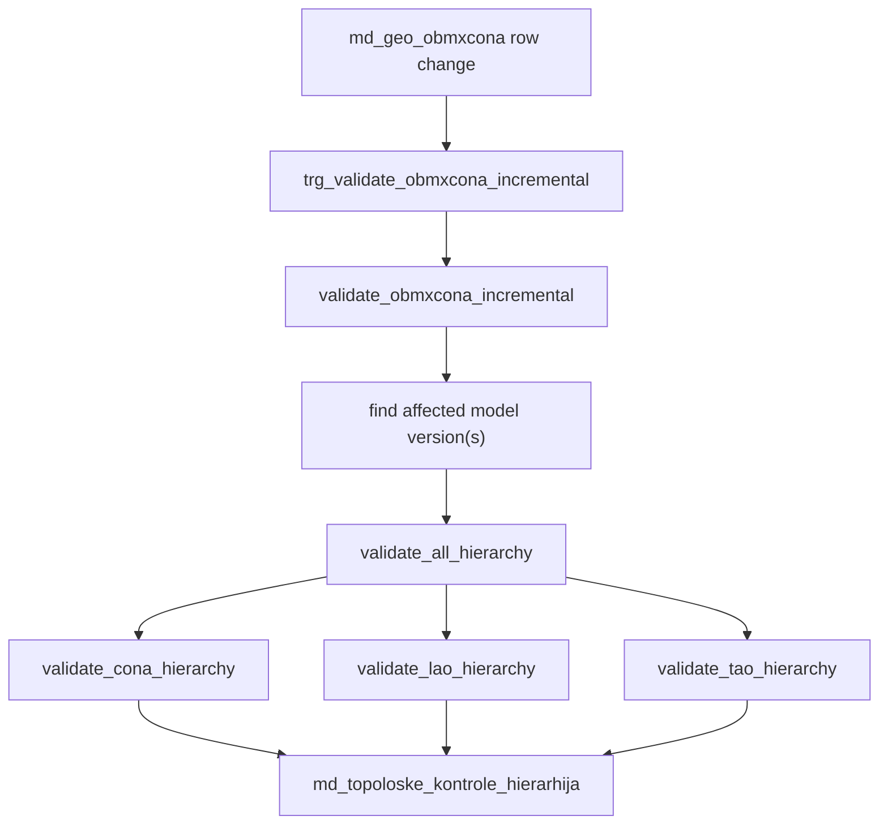
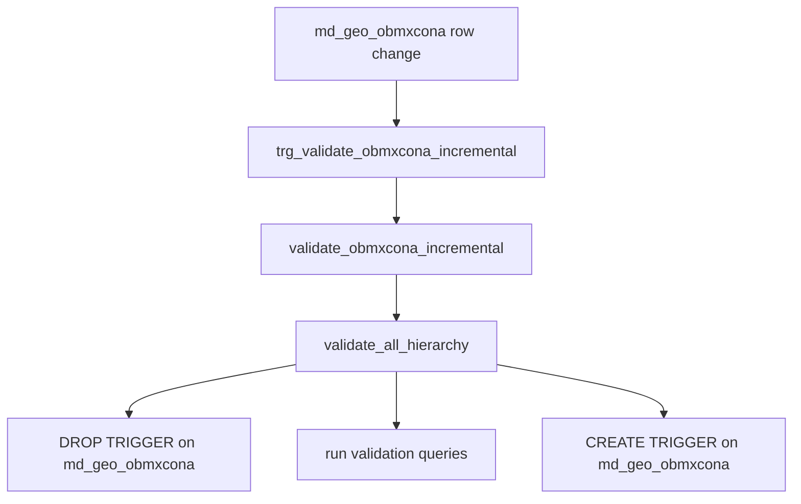
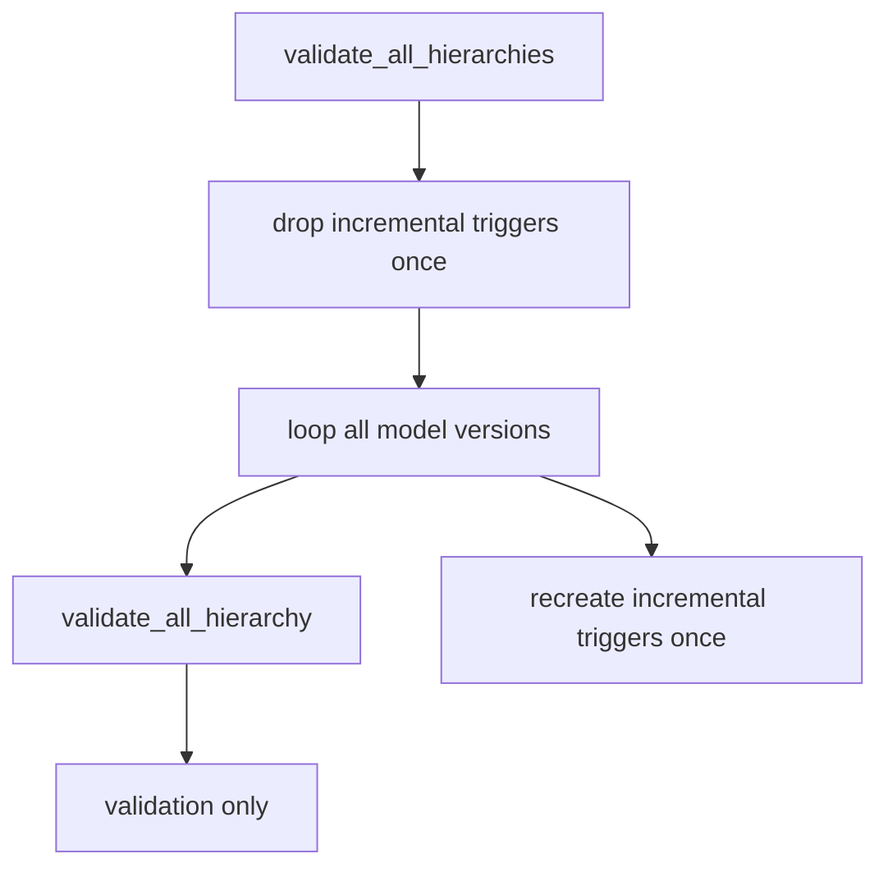
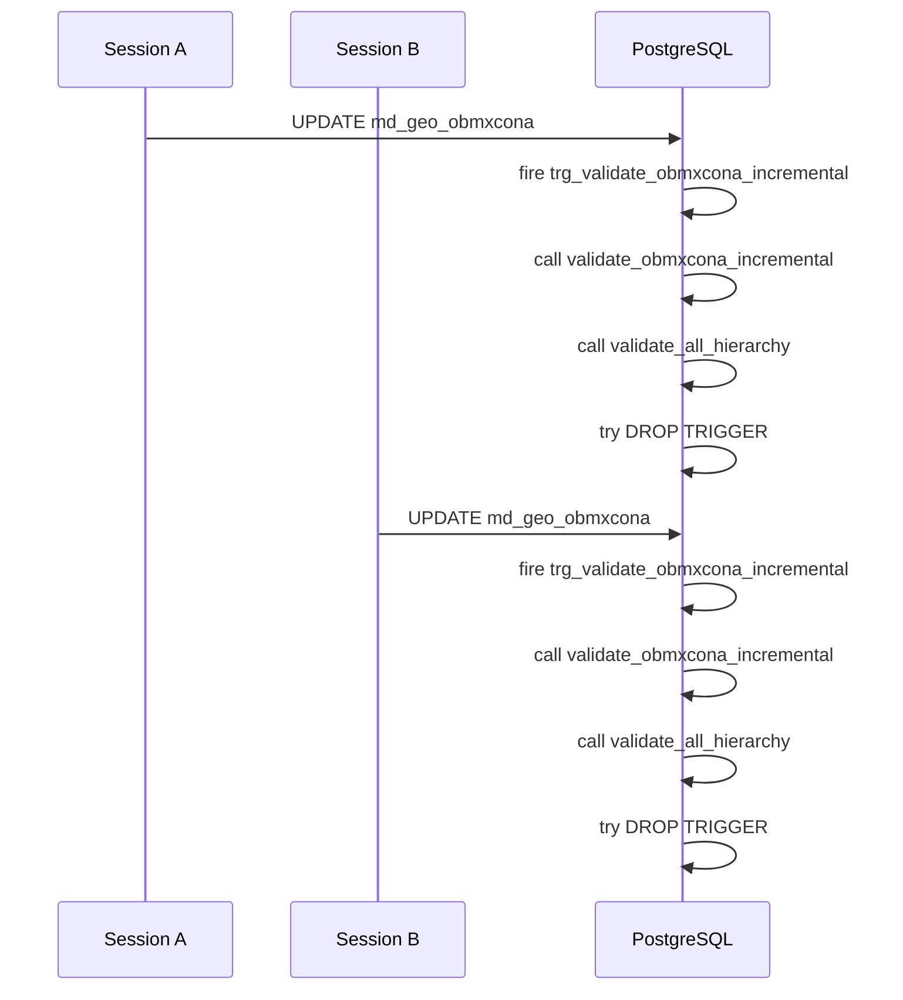

# Hierarchy Triggers

This is the shortest useful map of how the hierarchy validation chain works and where the deadlock came from.

## 1) Normal incremental path

- `trg_validate_obmxcona_incremental` is the row trigger on `md_geo_obmxcona`.
- `validate_obmxcona_incremental()` is the trigger function.
- It decides which model version is affected, then calls `validate_all_hierarchy(uuid)`.
- The validation functions write problem rows into `md_topoloske_kontrole_hierarhija`.

## 2) What used to happen

- The problem was not the row trigger itself.
- The problem was `validate_all_hierarchy(uuid)` doing `DROP TRIGGER` and `CREATE TRIGGER` inside a trigger-driven update.
- That is DDL inside normal DML, which is where the lock conflict came from.

## 3) Bulk path

- `validate_all_hierarchies()` is the explicit bulk wrapper.
- This is the only place where trigger suppression makes sense.
- `validate_all_hierarchy(uuid)` now stays pure and does not manage triggers.

## 4) Why it deadlocked

- Each session was holding row-update locks and then asking for stronger trigger DDL locks.
- Two sessions doing that in different order can deadlock.
- The fix was to remove trigger DDL from `validate_all_hierarchy(uuid)`.

## 5) Mental model

- Incremental trigger: keep hierarchy status current after one row change.
- Bulk wrapper: temporarily disable triggers while validating everything.
- Validation function: compute problems only, no trigger DDL.
