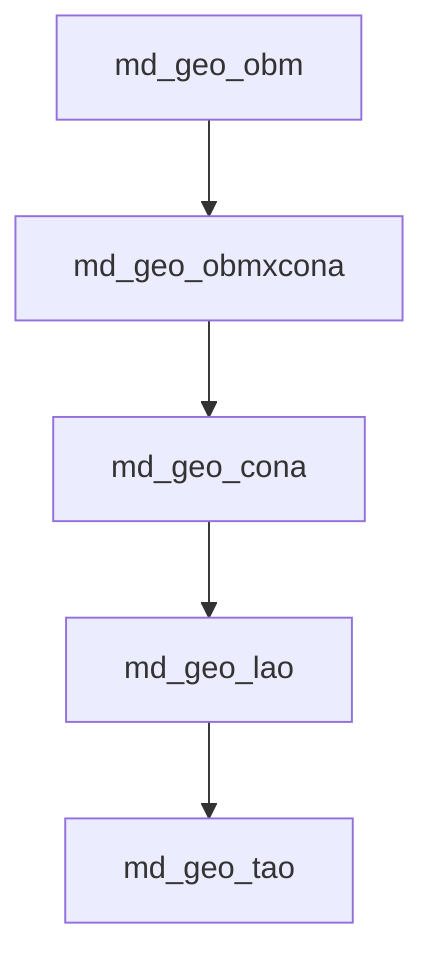
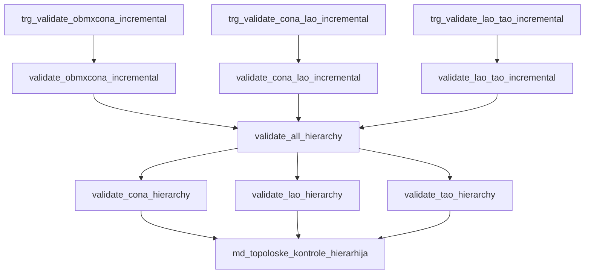
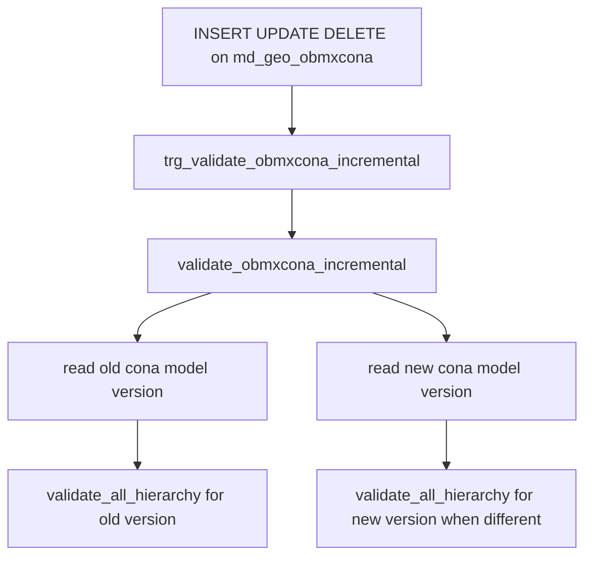
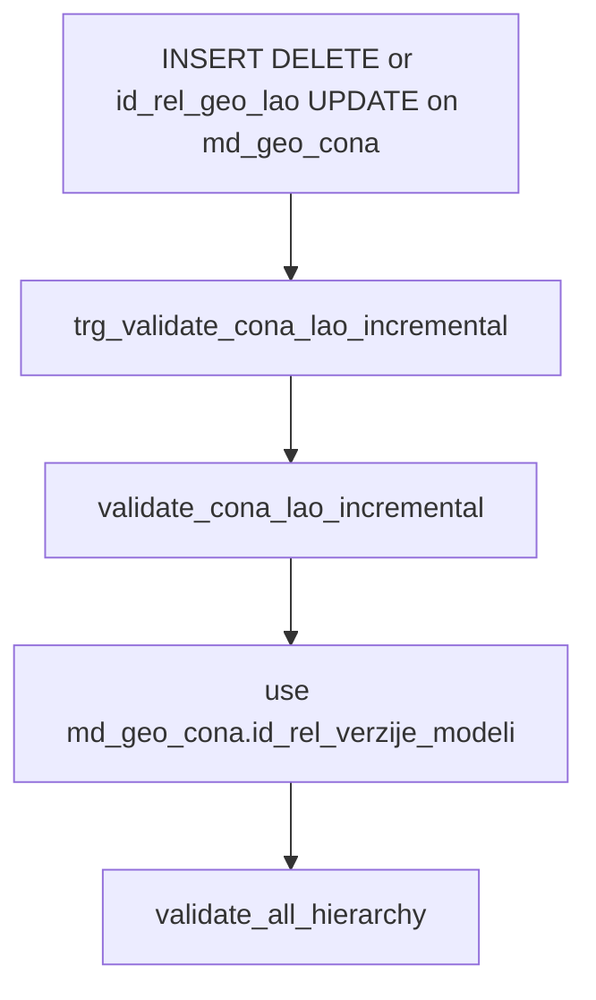
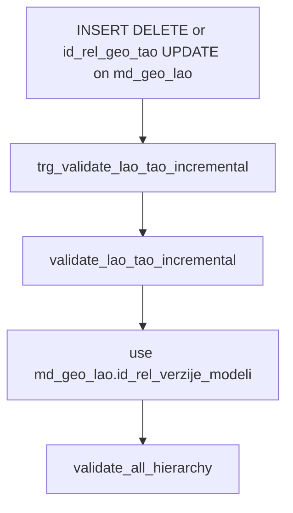
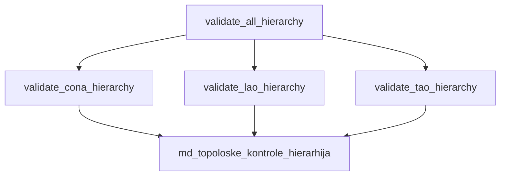
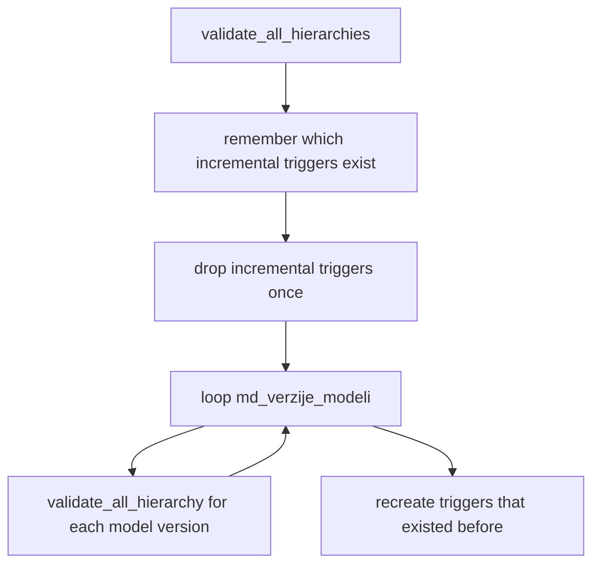
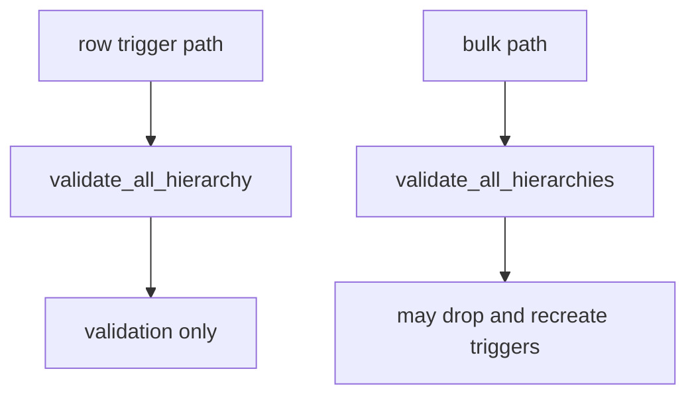

# Hierarchy Trigger Map

This explains what calls what in the hierarchy validation system.

The hierarchy is:

Validation results go into `md_topoloske_kontrole_hierarhija`.

## Main Pieces

Short version:

- Row triggers only decide when validation should run.
- Incremental trigger functions find the affected model version.
- `validate_all_hierarchy` runs all checks for one model version.
- The three lower validation functions delete and rewrite problem rows.

## Obm To Cona Changes

This path runs when `md_geo_obmxcona` changes.

Why it needs a lookup:

- `md_geo_obmxcona` has `id_rel_geo_cona`.
- The model version lives on `md_geo_cona.id_rel_verzije_modeli`.
- So this trigger function joins through `md_geo_cona`.

## Cona To Lao Changes

This path runs when a cona is added, deleted, or moved to another LAO.

Why it is simpler:

- `md_geo_cona` already has `id_rel_verzije_modeli`.
- No join is needed to find the affected model version.

## Lao To Tao Changes

This path runs when a LAO is added, deleted, or moved to another TAO.

Why it is simpler:

- `md_geo_lao` already has `id_rel_verzije_modeli`.
- No join is needed to find the affected model version.

## One Model Version Validation

`validate_all_hierarchy` validates one `id_rel_verzije_modeli`.

What each function checks:

- `validate_cona_hierarchy`: OBMs missing conas, bad OBM references, bad cona references, empty conas.
- `validate_lao_hierarchy`: conas missing LAO, bad LAO references, empty LAOs.
- `validate_tao_hierarchy`: LAOs missing TAO, bad TAO references, empty TAOs.

Each lower function first clears its own old problem rows for that model version, then inserts the current problems.

## Full Bulk Validation

`validate_all_hierarchies` validates every model version.

This is the only hierarchy validation function that should do trigger DDL.

Reason:

- Bulk validation deliberately touches many model versions.
- Dropping triggers once avoids repeated incremental revalidation during a full rebuild.
- The single-version function must stay normal DML only, because row triggers call it.

## Current Rule

Keep this split:

- Incremental path: trigger function calls `validate_all_hierarchy`.
- Single-version validation: no `DROP TRIGGER`, no `CREATE TRIGGER`.
- Bulk validation: `validate_all_hierarchies` may manage triggers around the full loop.

